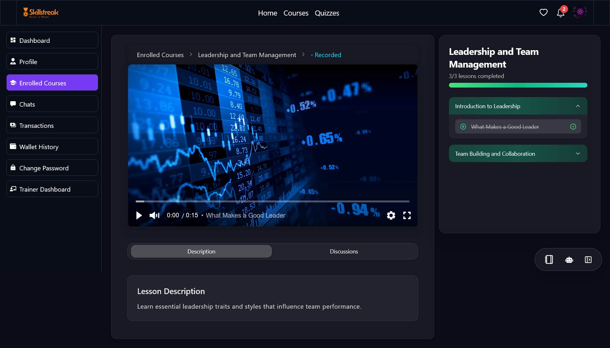
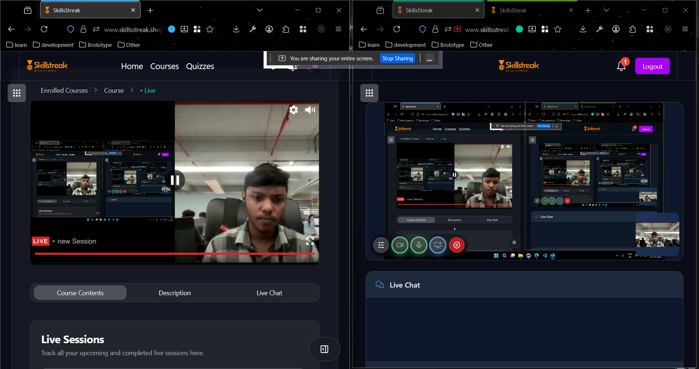
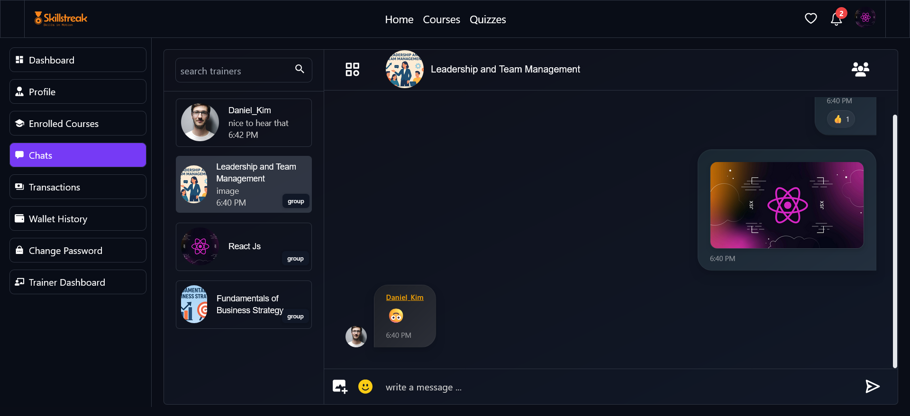
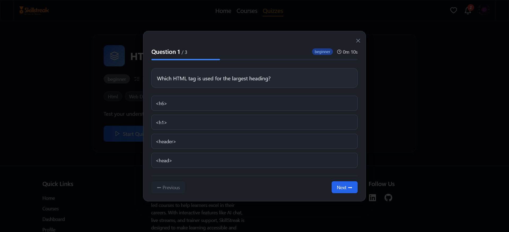

# 🛠️ SkillsStreak Backend — eLearning Platform

This is the **backend service** for **SkillsStreak**, a full-stack eLearning platform.  
It manages authentication, courses, assignments, quizzes, payments, live sessions, chat, and integrations with external services (**Cloudinary, Google OAuth, Stripe, LiveKit, AWS, Gemini**).

---


## 📚 Features

### 👤 Authentication & Authorization

- JWT-based authentication (access + refresh tokens)
- Role-based access (Student, Trainer, Admin)
- Secure password hashing using bcrypt
- Google OAuth support for social login
- Rate limiting & request throttling for security

---

### 📚 Course Management

- **Recorded sessions**: Upload and manage videos/PDFs (stored in AWS S3 & Cloudinary)
- **Live sessions**: Powered by LiveKit for interactive video/audio streaming
- Session replays stored and accessible on demand
- Progress tracking for users

  


---

### 📝 Assignments

- Students submit assignments in supported formats
- Trainers can review, approve, or reject submissions
- Automatic certificate eligibility check based on completion

---

### 🎓 Certificates

- Auto-generated certificates upon completion of recorded sessions + approved assignments
- Secure storage and verification

---

### 💬 Real-time Chat

- Group chat for enrolled users (course-specific)
- 1:1 trainer-student direct messaging
- Built on **Socket.io** with Redis pub/sub for scaling



---

### ❓ Quizzes

- Admins can create and manage quizzes
- Students can attempt quizzes linked to specific topics
- Automatic scoring and result storage



---

### 💳 Payments

- Stripe integration for secure transactions
- Supports one-time purchases and subscription plans
- Webhook handling for payment status updates

---

### 📊 Admin Capabilities

- Manage users (block)
- Manage courses, sessions, and assignments
- Manage quizzes
- Analytics endpoints for monitoring usage and payments

---

### ☁️ Integrations

- **Cloudinary** → Media storage for videos/PDFs
- **AWS S3** → Course assets & certificate storage
- **Google OAuth** → Social login
- **Gemini API** → AI model integration (future-ready for smart tutoring/quiz generation)
- **Redis** → Caching, chat scaling, and session store

---

## 🚀 Deployment

- **Backend** → AWS (EC2)
- **Database** → MongoDB Atlas
- **Cache** → Redis (managed or containerized)
- **Storage** → AWS S3 (via `AWS_BUCKET_NAME` & `AWS_ENDPOINT`)
- **CI/CD** → GitHub Actions → AWS

---

## 📦 Installation

Clone the repository:

```bash
git clone https://github.com/Ayush-Martin/SkillsStreak-Backend.git
cd SkillsStreak-Backend

```

Install dependencies:

```bash
npm install

```

Run in development:

```bash
npm run dev

```

Build and run in production:

```bash
npm run build
npm start

```

## 📧 Contact

👨‍💻 Author: **Ayush Martin**  
📩 Email: **[ayushmartin06@gmail.com](mailto:ayushmartin06@gmail.com)**
